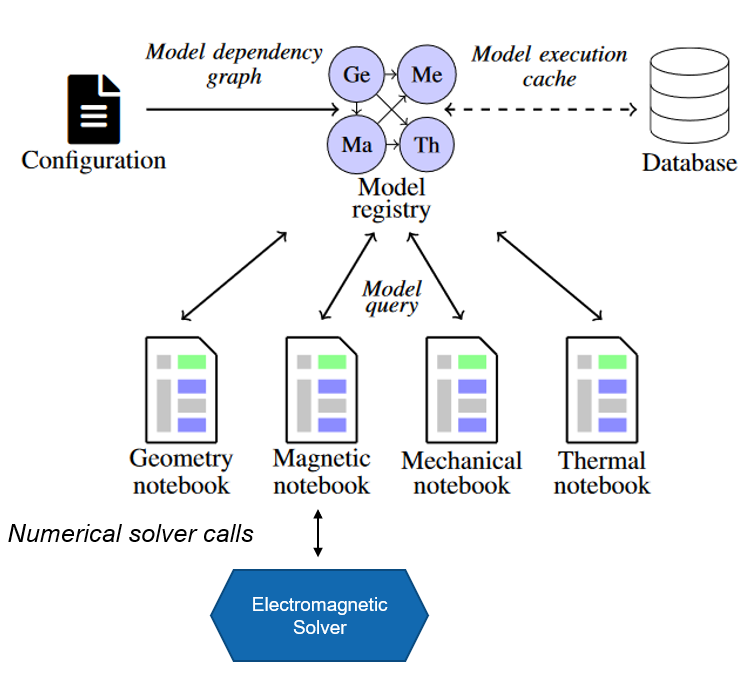
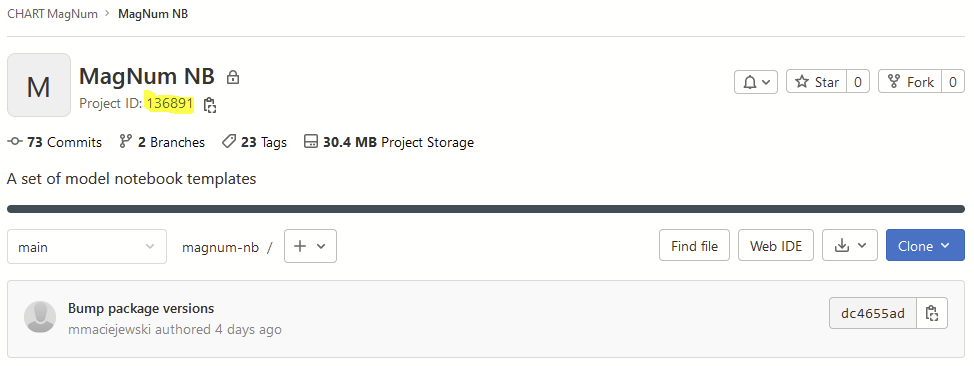
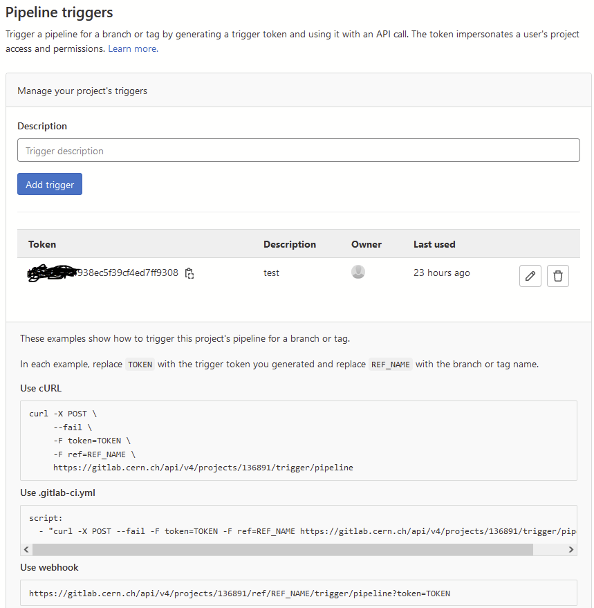
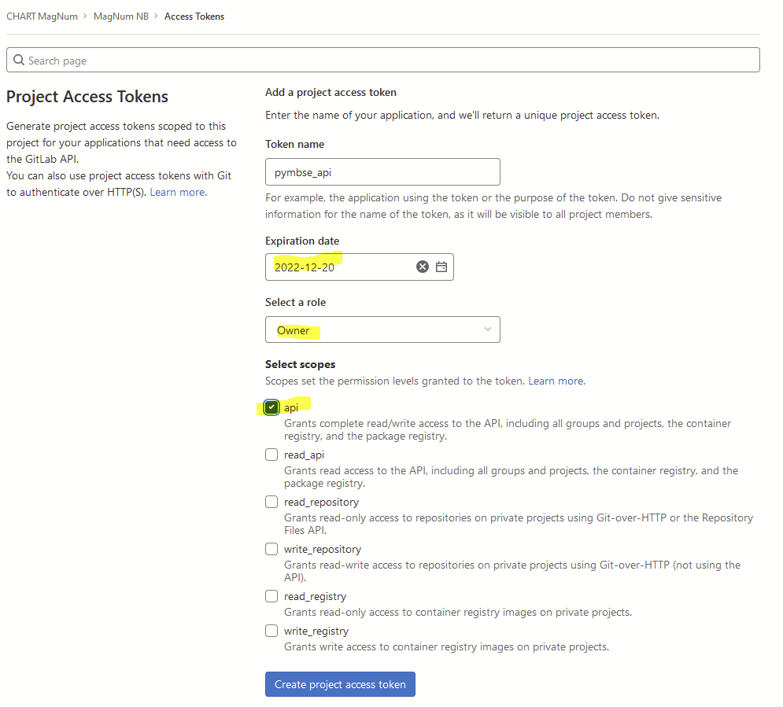

# PyMBSE

PyMBSE project aims at providing an API query mechanism for notebook-based numerical models.




The package is composed by two modules
- `pymbse.query` - an API providing a model query mechanism to exchange information either as figures of merit (scalar, vector parameters) or artefacts (output files of various type)
- `pymbse.microservice`an API providing a numerical solver query mechanism. A numerical solver is encapsulated in a container and the API provides endpoints to initialize a working directory, upload input files, run a solver, and download the artefacts

# Getting Started

Python version is 3.9+ along with pymbse package. The pymbse package is available at PyPI and can be installed with `pip install pymbse`.
We suggest to use a virtual environment to avoid clashes with globally installed packages.

For model query cache database installation, please consult [http://gitlab.cern.ch/chart-magnum/pymbse-cache](http://gitlab.cern.ch/chart-magnum/pymbse-cache)

---
**NOTE**
> Note that the PyMBSE model query mechanism works without a cache database. In this case, however, each model is always executed, which may lead to an excessive computation time.
---

# Configuration File

A configuration file provides information about the cache database and the model definition. The configuration file contains two keys

- Cache database configuration - `database`  
  The cache database stores snapshots of executed models in order to quickly retrieve both artefacts and output files. To access the cache database one needs to provide a pair of `ip` and `port`.

- Model(s) definition - `models`  
  `models` is a dictionary mapping from tags to model definitions. A model tag is a string referring to a model.

  A model definition is a dictionary. There are two modes for model execution: local and distributed (with GitLab).
  The keys of a local python notebook or a pythons script are explained in a table below.

| Key              | Value Type | Value Meaning                                                                                                                                                                                                                                                     |
|------------------|------------|-------------------------------------------------------------------------------------------------------------------------------------------------------------------------------------------------------------------------------------------------------------------|
| `model_abs_path` | `str`      | An absolute path to a model notebook. The path relates either to a location on host if jupyter server runs on host, or a location in a container for jupyter server running on the container.                                                                     |
| `model_type`     | `str`      | Allowed values are: `NOTEBOOK`, `SCRIPT`, `NOTEBOOK_SCRIPT` (model is given as a notebook, however for the sake of faster execution time, a notebook is converted to a function stored in a script.                                                               |
| `input_files`    | `list`     | A list of relatives paths (relative w.r.t. the model root directory taken from the `model_abs_path`) to input files that a model depends on. Should any of those files change, a model is executed again and corresponding snapshot stored in the cache database. |
| `needs`          | `list`     | A list of model tags on which a given model depends. Dependencies are used to construct a model dependency graph, which has to form a directed, acyclic graph.                                                                                                    |

For keys of a remote (GitLab) notebook are given in the following table

| Key                 | Value Type | Value Meaning                                                                                                                                                                                                                                                     |
|---------------------|------------|-------------------------------------------------------------------------------------------------------------------------------------------------------------------------------------------------------------------------------------------------------------------|
| `project_url`       | `str`      | A GitLab project URL with notebooks to execute                                                                                                                                                                                                                    |
| `branch_or_tag`     | `str`      | Name of a branch or tag with a particular version of notebooks to execute                                                                                                                                                                                         |
| `model_rel_path`    | `str`      | Relative path to a model w.r.t. the repository root                                                                                                                                                                                                               |
| `time_sleep_in_sec` | `int`      | Time sleep for checking whether the triggered pipeline with notebook execution has been completed.                                                                                                                                                                |
| `model_type`        | `str`      | Allowed values are: `NOTEBOOK`, `SCRIPT`, `NOTEBOOK_SCRIPT` (model is given as a notebook, however for the sake of faster execution time, a notebook is converted to a function stored in a script.                                                               |
| `input_files`       | `list`     | A list of relatives paths (relative w.r.t. the model root directory taken from the `model_abs_path`) to input files that a model depends on. Should any of those files change, a model is executed again and corresponding snapshot stored in the cache database. |
| `needs`             | `list`     | A list of model tags on which a given model depends. Dependencies are used to construct a model dependency graph, which has to form a directed, acyclic graph.                                                                                                    |


An example of a model configuration file is given below.
```yaml
database:
  ip: cache_rest
  port: 8000
models:
  geometry:
    model_abs_path: "/home/magnum/demo/geometry/Geometry.ipynb"
    model_type: "NOTEBOOK_SCRIPT"
    input_files: [ "input/16T_rel.json",
                   "../input/roxieold_2.cadata"]
    needs: [ ]
  magnetic:
    model_abs_path: "/home/magnum/demo/magnetic/ROXIE.ipynb"
    model_type: "NOTEBOOK_SCRIPT"
    input_files: [ "../input/roxieold_2.cadata" ]
    needs: [ "geometry" ]
  magnetic_current:
    model_abs_path: "/home/magnum/demo/magnetic/ROXIE_Current.ipynb"
    model_type: "NOTEBOOK_SCRIPT"
    input_files: [ "../input/roxieold_2.cadata" ]
    needs: [ "geometry" ]
  mechanical:
    model_abs_path: "/home/magnum/demo/mechanical/ANSYS.ipynb"
    model_type: "NOTEBOOK_SCRIPT"
    input_files: [ "input/Mechanic_Plate/15T_bc.inp",
                   "input/Mechanic_Plate/15T_Coil_geo.inp",
                   "input/Mechanic_Plate/15T_contact_el_m.inp",
                   "input/Mechanic_Plate/15T_contact_mesh.inp",
                   "input/Mechanic_Plate/15T_geometry_main.inp",
                   "input/Mechanic_Plate/15T_mat_and_elem.inp",
                   "input/Mechanic_Plate/15T_mech.inp",
                   "input/Mechanic_Plate/15T_mech_post_roxie.inp",
                   "input/Mechanic_Plate/15T_mech_solu.inp",
                   "input/Mechanic_Plate/15T_Yoke_geo.inp",
                   "input/Mechanic_Plate/CoilBlockMacro_Roxie.mac",
                   "input/Mechanic_Plate/ContactPropMacro.mac" ]
    needs: [ "geometry", "magnetic" ]
  thermal:
    model_abs_path: "/home/magnum/demo/thermal/MIITs.ipynb"
    model_type: "NOTEBOOK_SCRIPT"
    input_files: [ "../input/roxieold_2.cadata" ]
    needs: [ "geometry", "magnetic" ]
  thermal_gitlab:
    project_url: "https://gitlab.cern.ch/api/v4/projects/136891"
    branch_or_tag: "main"
    model_rel_path: "demo/thermal/MIITs_GitLab.ipynb"
    time_sleep_in_sec: 1
    model_type: "GITLAB_NOTEBOOK"
    input_files: []
    needs: []
```

# GitLab Pipeline Trigger

A distributed notebook execution is implemented as triggering of a pipeline running on a dedicated executor.

Project URL contains project ID at the end. In the example above it is `136891`. 
The ID is available at the main project page.



In addition, for GitLab two environment variables need to be set for PyMBSE to work:
1. pipeline token
> Pipeline trigger is created by going to Settings -> CI/CD -> Pipeline triggers



Set the pipeline trigger as an environment variable:
```bash
export PIPELINE_TRIGGER=your_pipeline_trigger
```

2. private token for API
> Private token is created by going to Settings -> Access Tokens



For the security sake set an expiry date, `Owner` as role, and `api` for the scope.

Set the private token as an environment variable:
```bash
export PRIVATE_TOKEN=your_private_token
```

# Model Query API

Model Query API provides 5 endpoints to execute models and retrieve figures of merit, artefacts, and reports.

In the following we assume that the configuration file (displayed above) is available in the current working directory as `model_configuration.yml`.

1. Query for figures of merit

    Return type: `dict`

    Keys: name of a figure of merit as an `str` type

    Values: either a scalar or multi-dimensional value

```python
from pymbse.query.api import PyMBSE

PyMBSE(config_path="model_configuration.yml", source_model="magnetic", target_model="geometry", inputs={...}).build().get_figures_of_merit()
```

#### Example


2. Query for all artefacts

   Return type: `dict`

   Keys:  artefact names  as `str`

   Values: binary artefact content as an `str` type

```python
from pymbse.query.api import PyMBSE

PyMBSE(config_path="model_configuration.yml", source_model="magnetic", target_model="geometry", inputs={...}).build().get_artefacts()
```

3. Query for an artefact

   Return type: `str`

```python
from pymbse.query.api import PyMBSE

PyMBSE(config_path="model_configuration.yml", source_model="magnetic", target_model="geometry", inputs={...}).build().get_artefact(name="geometry")
```

4. Query for an HTML report

   Return type: `str` with executed HTML report

```python
from pymbse.query.api import PyMBSE

PyMBSE(config_path="model_configuration.yml", source_model="magnetic", target_model="geometry", inputs={...}).build().get_html_report()
```

5. Query for a Notebook file with outputs

   Return type: `str` with executed notebook content

```python
from pymbse.query.api import PyMBSE

PyMBSE(config_path="model_configuration.yml", source_model="magnetic", target_model="geometry", inputs={...}).build().get_ipynb_report()
```

# Microservice API

Although, the microservice API provides ve functions:
- `init`
- `upload_input_files`
- `run`
- `get_artefact_names`
- `download_artefacts`

we grouped the first three functions into one `init_upload_and_run` to prepare and run a simulation in one shot.

An example for ROXIE electromagnetic solver is given below.

---
**NOTE**
> In the following we assume that a ROXIE container with REST-API (for more details please consult [http://gitlab.cern.ch/roxie/roxie-rest-api](http://gitlab.cern.ch/roxie/roxie-rest-api)) is running on `localhost` at port `8080`.
In addition, a `test_model.data` and `roxie.cadata` are available in the working directory (otherwise one needs to adjust the paths).
---

```python
from pymbse.microservice.api import init_upload_and_run, download_artefact

url_with_port = "http://roxie:8080"
model_name = "test_model"

input_files = [f"{model_name}.data", "roxie.cadata"]
model_name, timestamp, output_lines, artefact_names = init_upload_and_run(url_with_port, model_name, input_files)

input_dir = "."
for artefact_name in artefact_names:
    download_artefact(url_with_port, model_name, timestamp, input_dir, artefact_name)
```
